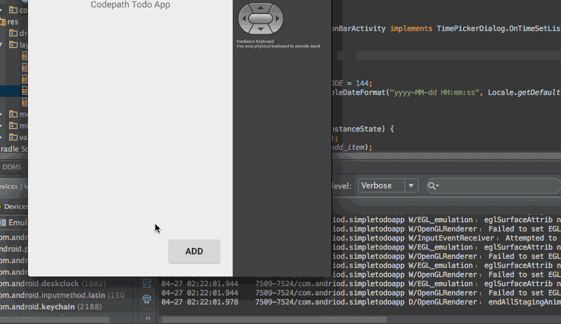
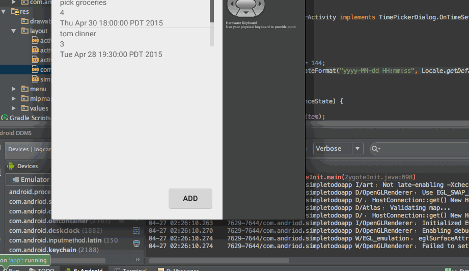
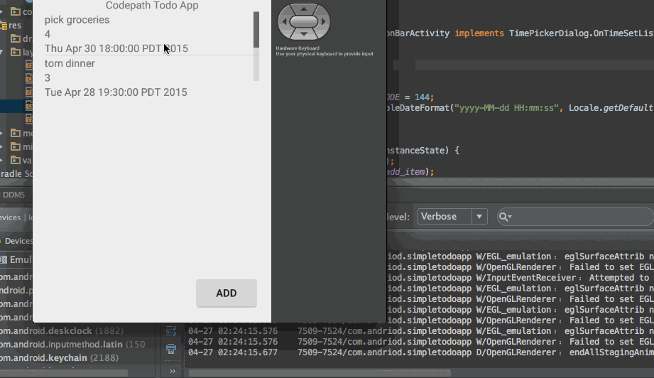

Simple Todo App

This is a simple todo application for providing a great overview of your tasks. 

User stories
============

   * [x] Required: User can view a list of todo items. 
   * [x] Required: User can click on a todo item to edit the description. 
   * [x] Required: User can long click on a todo item and the item gets deleted from the list.
   * [x] Optional: Data is store in SQLite instead of a flat file. 
   * [x] Optional: Added custom adaptor for listview of todo items. 
   * [x] Optional: Added support for completion due dates for todo items. 
   * [x] Optional: Use a DialogFragment instead of new Activity.
   * [x] Optional: Added support for selecting priority of each todo item between 1 and 5

Demo of all the user stories
============================
1. Adding Item

2. Delete Item

3. Edit Item

GIF created with [LiceCap](http://www.cockos.com/licecap/).

